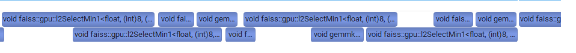

# Analysis Summary

```txt
RTX 2060
SM Count 30
L2 Cache Size 3M
Memory Bandwidth 312.97 GiB/s
Memory Size 5.77GB
Core Clock 1.68GHz
```

## Modeling
batch_size
### IVF
- Parameters: nlist, nprobe, d
IVF-Flat (nb = nlist)

```txt
sudo nsys profile --stats=true --trace=cuda ./IVFPQ-GPU --nq 1000000 --nlist 100000 --nprobe 100 --k 100
8-d1024_nb100000_nq1000000_nlist100_nprobe10_k100_m8_bits8_u0
=> l2SelectMinK: 1953 instances, average 200000ns
=> tilesize:（512, 100）
=> instances: 1000000 / 512 = 1953
=> 1 pass IO over a submatrix of (query_id, centroid_id), 512 * 100 * 4Byte = 200KB, 
=> bandwidth = 200K / 2e5ns = 1GB/s 

Questions:
    kernel之间的overlap? 
    用了多少SM?
    grid_size 512x8

    dim = 1, k = 100
    separate scan(multiplication) / l2select (same k)
    t2 - t1 ~= scan
```

| nprobe | overall time(ms) | average kernel time(ns) | overall bandwidth | per kernel bandwidth |
| - | - | - | - | - |
| 1 | 15.8 | 24000 | 60.2 | 40.7 |
| 25 | 17.4 | 55260 | 54.7 | 17.7 |
| 50 | 20.7 | 65887 | 46.1 | 14.8 |
| 75 | 28.0 | 90957 | 34.1 | 10.7 |
| 100 | 37.0 | 95570 | 25.8 | 10.2 |
| 125 | 34.9 | 95094 | 27.3 | 10.3 | 
| 150 | 53.7 | 172696 | 17.8 | 5.7 |
| 175 | 65.4 | 177901 | 14.6 | 5.5 |
| 200 | 54.1 | 166998 | 17.6 | 5.8 |
| 225 | 59.6 | 181900 | 16.0 | 5.4 |
| 250 | 54.5 | 176817 | 17.5 | 5.5 |

report13 - 250_select
report11 - 1_select


Questions:
    - nprobe较大时，kernel bandwidth并未显著下降
    - 似乎是2个SM，2个kernel并行？
    - Data copy overhead?


### Construct LUT
k=1, nb = 1
### PQ-scan

8 * 1e6 * 3e5 * 1byte / 1s = 24e11 byte/s = 2400 GB / s
### k-select