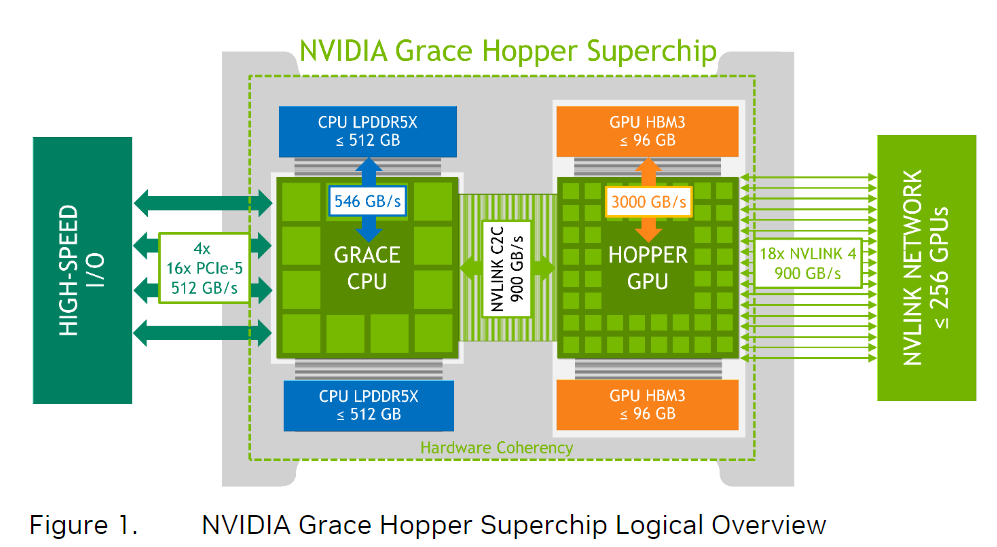

```cmake
if(FAISS_ENABLE_GPU)
  include_directories("/usr/local/cuda/include")
endif()
```
```sh
cmake -B build . -DCMAKE_CUDA_ARCHITECTURES="75" -DCUDAToolkit_ROOT="/usr/local/cuda"
cmake -B build . -DCMAKE_CUDA_ARCHITECTURES="75" -DCUDAToolkit_ROOT="/usr/local/cuda" -DBLAS_LIBRARIES="/mnt/scratch/xiaowu/OpenBLASLib/lib" -DLAPACK_LIBRARIES="/home/xiaowu/.local/liblapack.a/"
```
In c_cpp_properties.json
```json
  ...
  "compilerPath": "/usr/local/cuda/bin/nvcc",
  ...
```

```
sudo nsys profile --stats=true --trace=cuda ./IVFPQ-GPU
```

```txt
nb, n: database size
nq: number of queries
d: dimensionality of the input vectors
k: k nearest neighbors
M, m, subQuantizers = 8 : number of subquantizers
nbits: number of bits per subvector index (per quantization index)
dsub = d / M: dimensionality of each subvector
ksub = 1 << nbits: number of centroids for each subquantizer
nprobe: number of probes at query time (IVF)
nlist = 100 : number of inverted lists, defined in IndexIVF.h
bitsPerCode = 8

Train_hot_start,     ///< the centroids are already initialized
Train_shared,        ///< share dictionary accross PQ segments
Train_hypercube,     ///< initialize centroids with nbits-D hypercube
Train_hypercube_pca, ///< initialize centroids with nbits-D hypercube

centroids: (M, ksub, dsub)

IndexPQ: 继承IndexFlatCodes，包含ProductQuantizer
ProductQuantizer::train
    xlice: 根据m，取x的某几层作为subvector
    clus.train(n, xslice, assign_index ? *assign_index : index);
        Clustering::train_encoded(n, xslice, nullptr, index, weights)
            subsample_training_set
```
In main func:
```cpp
    faiss::gpu::GpuIndexFlatL2 quantizer(&res, d); // the other index
    faiss::gpu::GpuIndexIVFPQ index(&res, &quantizer, d, nlist, m, 8);

    index.train(nb, xb);
    index.add(nb, xb);

    ...
    idx_t* I = new idx_t[k * 5];
    float* D = new float[k * 5];

    index.search(5, xb, k, D, I);
```

```cpp
class GpuIndexIVFPQ:
  // Trains the coarse and product quantizer based on the given vector data
  void train(idx_t n, const float* x) override;

  // = GpuIndex::add
  // Add n vectors of dimension d to the index
  // Vectors are implicitly assigned labels ntotal .. ntotal + n - 1
  void add(idx_t, const float* x) override;
    baseIndex_->addVectors

  // = GpuIndex::search
  void search(idx_t n, const float* x, idx_t k, float* distances, idx_t* labels, const SearchParameters* params) const

  // Called from GpuIndex for search
  void searchImpl(idx_t n,const float* x,int k,float* distances,idx_t* labels,const SearchParameters* params) const override;
```

```cpp
GpuIndexFlat::searchImpl_ // calls data_->query
  FlatIndex::query
    bfKnnOnDevice
      runL2Distance
        runDistance
          runL2Norm
          runMatrixMult
          runL2SelectMin
            l2selectMin1(kernel)

GpuIndexIVFPQ::search = GpuIndex::search // make sure searchImpl_ called with device-resident pointers
  // outDistances, outLabels = toDeviceTemporary...
  // Currently, we don't handle the case where the output data won't fit on the GPU
  GpuIndex::searchFromCpuPaged_ or searchNonPaged_ // batch-processing queries by using pinned memories
  // batchSize = nextHighestPowerOf2((kNonPinnedPageSize / (sizeof(float) * this->d)))
    GpuIndexIVF::searchImpl_ // set nprobe, calls baseIndex_::search(inited in GpuIndexIVFPQ)
      IVFPQ::search
        IVFBase::searchCoarseQuantizer_ // Performs search in a CPU or GPU coarse quantizer for IVF cells, calls coarseQuantizer::search
          GpuIndex::search
            GpuIndexFlat::searchImpl_ // called from GpuIndex::search, calls data_->query
              FlatIndex::query
                bfKnnOnDevice
                  runL2Distance
                    runDistance
                      runL2Norm
                      runMatrixMult
                      runL2SelectMin
                        l2selectMin1(kernel)
        IVFPQ::searchImpl_
          IVFPQ::runPQPrecomputedCodes_ // Performs matrix multiplication
            runTransposeAny
              transposeOuter(kernel)
              transposeAny(kernel)
            runBatchMatrixMult
              rawBatchGemm
                cublasGemmStridedBatchedEx(kernel) // cublas kernel
            IVFPQ::runPQScanMultiPassPrecomputed // same as below
          IVFPQ::runPQNoPrecomputedCodes_
            runPQScanMultiPassNoPrecomputed
              runMultiPassTile
                runCalcListOffsets // Calculate offset lengths, so we know where to write out intermediate results
                runPQCodeDistances // Calculate residual code distances, since this is without precomputed codes
                  pqCodeDistances(kernel)
                pqScanInterleaved(kernel)
                pqScanNoPrecomputedMultiPass(kernel)
                runPass1SelectLists(kernel) // k-select the output in chunks, to increase parallelism
                runPass2SelectLists(kernel) // select final results

```

sgemm: Single Precision General Matrix Multiplication

grace hopper: CPU-GPU NVLink bandwidth 900GB/s
